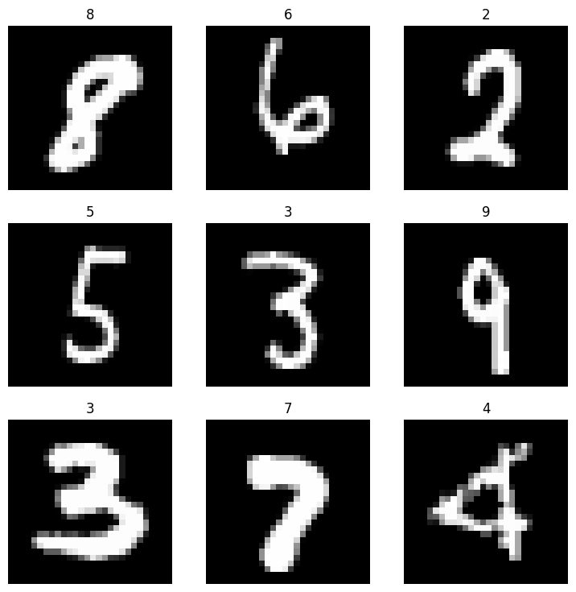
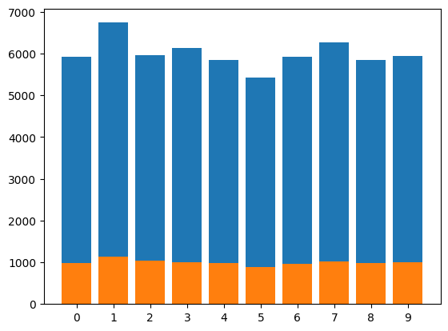
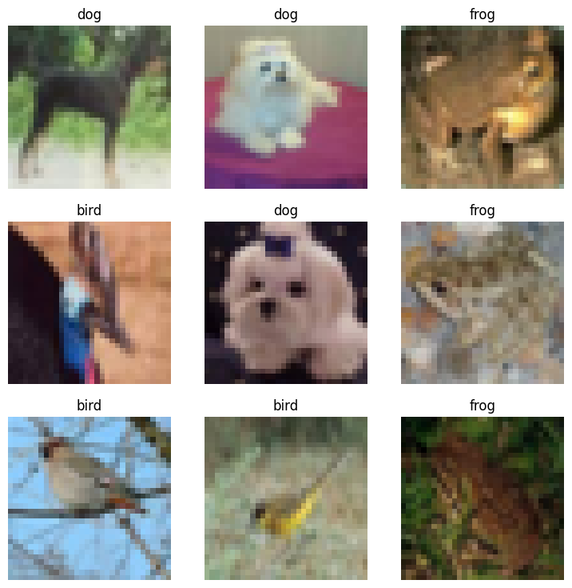
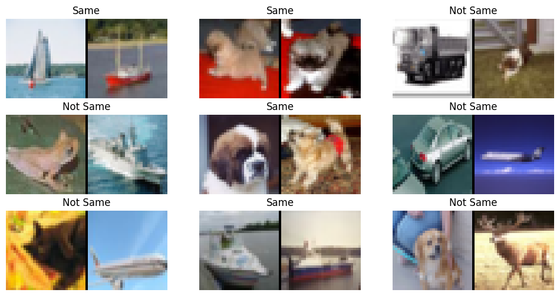

fastai-datasets
================

<!-- WARNING: THIS FILE WAS AUTOGENERATED! DO NOT EDIT! -->

# Docs

See https://irad-zehavi.github.io/fastai-datasets/

## Install

``` sh
pip install fastai_datasets
```

## How to use

As an nbdev library, `fatai_datasets` supports `import *` (without
importing unwanted symbols):

``` python
from fastai_datasets.all import *
```

Here are a few usage examles:

### Easily load a dataset

``` python
mnist = MNIST()
mnist.dls().show_batch()
```



### Show the class distribution

``` python
mnist.plot_class_distribution()
```

    Class map: scanning targets:   0%|          | 0/60000 [00:00<?, ?it/s]

    Class map: partitioning:   0%|          | 0/10 [00:00<?, ?it/s]

    Class map: scanning targets:   0%|          | 0/10000 [00:00<?, ?it/s]

    Class map: partitioning:   0%|          | 0/10 [00:00<?, ?it/s]



### Sample a subset

Whole datasets:

``` python
mnist
```

    [(#60000) [(PILImage mode=RGB size=28x28, TensorCategory(0)),(PILImage mode=RGB size=28x28, TensorCategory(0)),(PILImage mode=RGB size=28x28, TensorCategory(0)),(PILImage mode=RGB size=28x28, TensorCategory(0)),(PILImage mode=RGB size=28x28, TensorCategory(0)),(PILImage mode=RGB size=28x28, TensorCategory(0)),(PILImage mode=RGB size=28x28, TensorCategory(0)),(PILImage mode=RGB size=28x28, TensorCategory(0)),(PILImage mode=RGB size=28x28, TensorCategory(0)),(PILImage mode=RGB size=28x28, TensorCategory(0))...]
    (#10000) [(PILImage mode=RGB size=28x28, TensorCategory(0)),(PILImage mode=RGB size=28x28, TensorCategory(0)),(PILImage mode=RGB size=28x28, TensorCategory(0)),(PILImage mode=RGB size=28x28, TensorCategory(0)),(PILImage mode=RGB size=28x28, TensorCategory(0)),(PILImage mode=RGB size=28x28, TensorCategory(0)),(PILImage mode=RGB size=28x28, TensorCategory(0)),(PILImage mode=RGB size=28x28, TensorCategory(0)),(PILImage mode=RGB size=28x28, TensorCategory(0)),(PILImage mode=RGB size=28x28, TensorCategory(0))...]]

Subset:

``` python
mnist.random_sub_dsets(1000)
```

    [(#874) [(PILImage mode=RGB size=28x28, TensorCategory(0)),(PILImage mode=RGB size=28x28, TensorCategory(7)),(PILImage mode=RGB size=28x28, TensorCategory(9)),(PILImage mode=RGB size=28x28, TensorCategory(3)),(PILImage mode=RGB size=28x28, TensorCategory(5)),(PILImage mode=RGB size=28x28, TensorCategory(5)),(PILImage mode=RGB size=28x28, TensorCategory(7)),(PILImage mode=RGB size=28x28, TensorCategory(7)),(PILImage mode=RGB size=28x28, TensorCategory(2)),(PILImage mode=RGB size=28x28, TensorCategory(4))...]
    (#126) [(PILImage mode=RGB size=28x28, TensorCategory(2)),(PILImage mode=RGB size=28x28, TensorCategory(7)),(PILImage mode=RGB size=28x28, TensorCategory(0)),(PILImage mode=RGB size=28x28, TensorCategory(2)),(PILImage mode=RGB size=28x28, TensorCategory(7)),(PILImage mode=RGB size=28x28, TensorCategory(4)),(PILImage mode=RGB size=28x28, TensorCategory(4)),(PILImage mode=RGB size=28x28, TensorCategory(6)),(PILImage mode=RGB size=28x28, TensorCategory(0)),(PILImage mode=RGB size=28x28, TensorCategory(0))...]]

### Construct a subset based on classes

``` python
cifar10 = CIFAR10()
dig_frog_bird = cifar10.by_target['dog'] + cifar10.by_target['frog'] + cifar10.by_target['bird']
dig_frog_bird.dls().show_batch()
```

    Class map: scanning targets:   0%|          | 0/60000 [00:00<?, ?it/s]

    Class map: partitioning:   0%|          | 0/10 [00:00<?, ?it/s]



### Construct a dataset of similarity pairs

``` python
Pairs(cifar10, .01).dls().show_batch()
```

    Class map: scanning targets: 0it [00:00, ?it/s]

    Generating positive pairs:   0%|          | 0/250 [00:00<?, ?it/s]

    Generating negative pairs:   0%|          | 0/250 [00:00<?, ?it/s]

    Class map: scanning targets: 0it [00:00, ?it/s]

    Generating positive pairs:   0%|          | 0/50 [00:00<?, ?it/s]

    Generating negative pairs:   0%|          | 0/50 [00:00<?, ?it/s]


