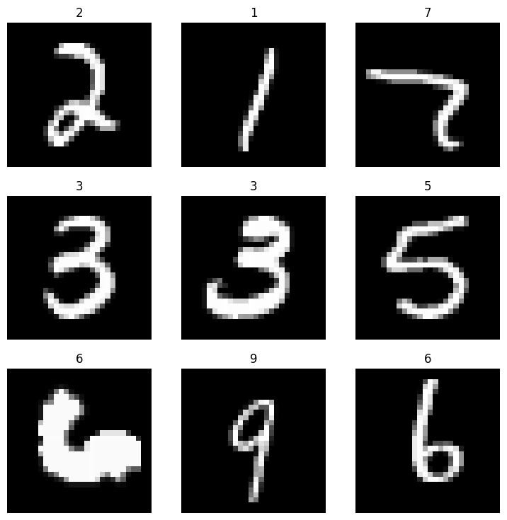

# fast-datasets

<!-- WARNING: THIS FILE WAS AUTOGENERATED! DO NOT EDIT! -->

## Install

``` sh
pip install fast_datasets
```

## How to use

``` python
from fast_datasets.mnist import MNIST

MNIST().dls().show_batch()
```


