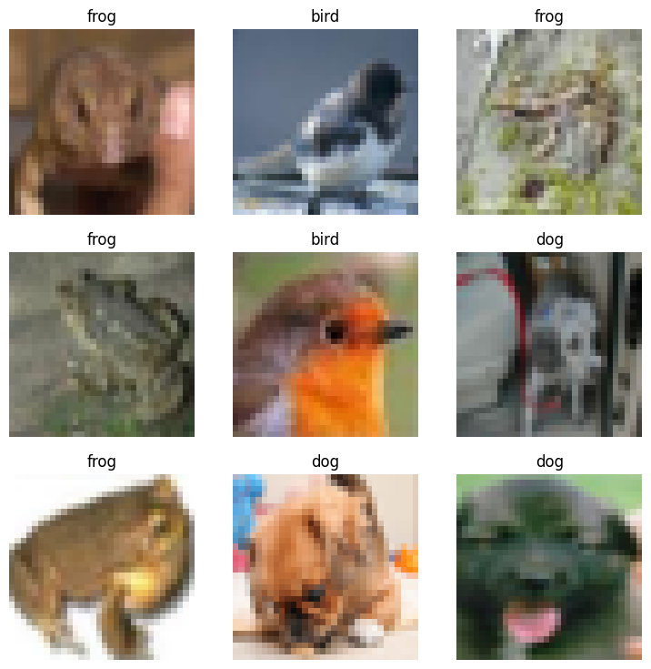
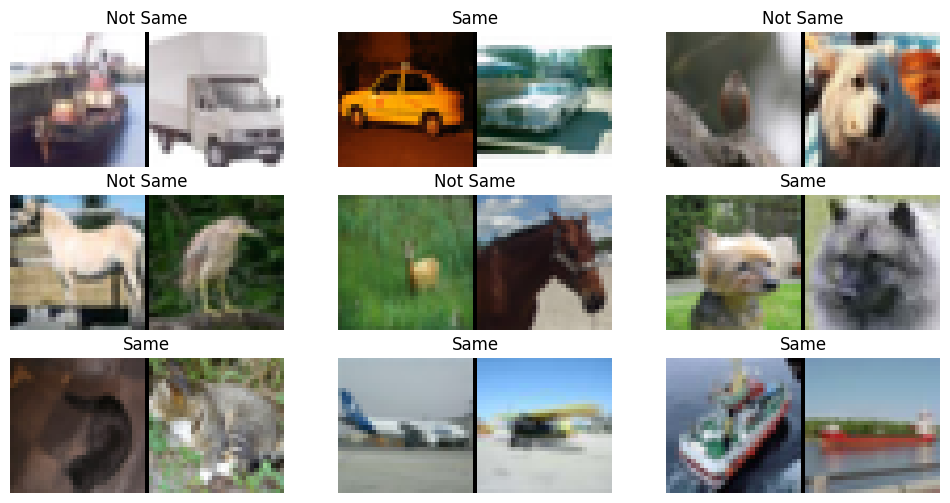

fastai-datasets
================

<!-- WARNING: THIS FILE WAS AUTOGENERATED! DO NOT EDIT! -->

## Docs

See https://irad-zehavi.github.io/fastai-datasets/

## Install

``` sh
pip install fastai_datasets
```

## How to use

As an nbdev library, `fatai_datasets` supports `import *` (without
importing unwanted symbols):

``` python
from fastai_datasets.all import *
```

Here are a few usage examles:

### Easily load a dataset

``` python
mnist = MNIST()
mnist.dls().show_batch()
```


### Show the class distribution

``` python
mnist.plot_class_distribution()
```


### Sample a subset

Whole datasets:

``` python
mnist
```

    [(#60000) [(PILImageBW mode=L size=28x28, TensorCategory(7)),(PILImageBW mode=L size=28x28, TensorCategory(7)),(PILImageBW mode=L size=28x28, TensorCategory(7)),(PILImageBW mode=L size=28x28, TensorCategory(7)),(PILImageBW mode=L size=28x28, TensorCategory(7)),(PILImageBW mode=L size=28x28, TensorCategory(7)),(PILImageBW mode=L size=28x28, TensorCategory(7)),(PILImageBW mode=L size=28x28, TensorCategory(7)),(PILImageBW mode=L size=28x28, TensorCategory(7)),(PILImageBW mode=L size=28x28, TensorCategory(7))...]
    (#10000) [(PILImageBW mode=L size=28x28, TensorCategory(7)),(PILImageBW mode=L size=28x28, TensorCategory(7)),(PILImageBW mode=L size=28x28, TensorCategory(7)),(PILImageBW mode=L size=28x28, TensorCategory(7)),(PILImageBW mode=L size=28x28, TensorCategory(7)),(PILImageBW mode=L size=28x28, TensorCategory(7)),(PILImageBW mode=L size=28x28, TensorCategory(7)),(PILImageBW mode=L size=28x28, TensorCategory(7)),(PILImageBW mode=L size=28x28, TensorCategory(7)),(PILImageBW mode=L size=28x28, TensorCategory(7))...]]

Subset:

``` python
mnist.random_sub_dsets(1000)
```

    [(#861) [(PILImageBW mode=L size=28x28, TensorCategory(3)),(PILImageBW mode=L size=28x28, TensorCategory(6)),(PILImageBW mode=L size=28x28, TensorCategory(7)),(PILImageBW mode=L size=28x28, TensorCategory(3)),(PILImageBW mode=L size=28x28, TensorCategory(3)),(PILImageBW mode=L size=28x28, TensorCategory(3)),(PILImageBW mode=L size=28x28, TensorCategory(4)),(PILImageBW mode=L size=28x28, TensorCategory(1)),(PILImageBW mode=L size=28x28, TensorCategory(5)),(PILImageBW mode=L size=28x28, TensorCategory(1))...]
    (#139) [(PILImageBW mode=L size=28x28, TensorCategory(0)),(PILImageBW mode=L size=28x28, TensorCategory(0)),(PILImageBW mode=L size=28x28, TensorCategory(1)),(PILImageBW mode=L size=28x28, TensorCategory(2)),(PILImageBW mode=L size=28x28, TensorCategory(8)),(PILImageBW mode=L size=28x28, TensorCategory(4)),(PILImageBW mode=L size=28x28, TensorCategory(2)),(PILImageBW mode=L size=28x28, TensorCategory(8)),(PILImageBW mode=L size=28x28, TensorCategory(1)),(PILImageBW mode=L size=28x28, TensorCategory(9))...]]

### Construct a subset based on classes

``` python
cifar10 = CIFAR10()
dig_frog_bird = cifar10.by_target['dog'] + cifar10.by_target['frog'] + cifar10.by_target['bird']
dig_frog_bird.dls().show_batch()
```



### Construct a dataset of similarity pairs

``` python
Pairs(cifar10, .01).dls().show_batch()
```


