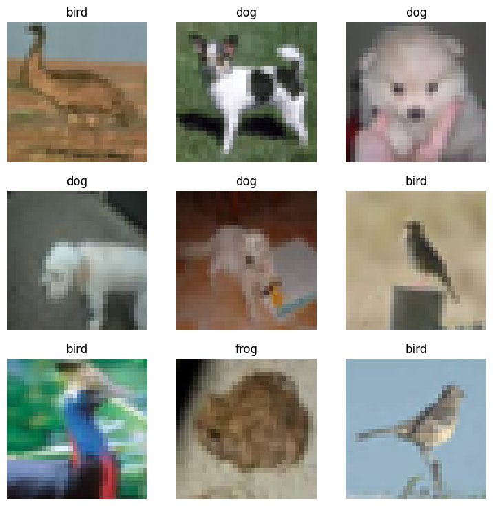
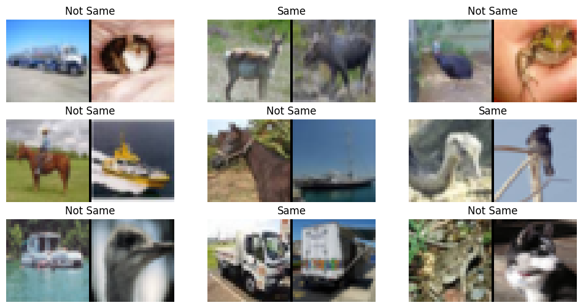

fastai-datasets
================

<!-- WARNING: THIS FILE WAS AUTOGENERATED! DO NOT EDIT! -->

# Docs

See https://irad-zehavi.github.io/fastai-datasets/

## Install

``` sh
pip install fastai_datasets
```

## How to use

As an nbdev library, `fatai_datasets` supports `import *`:

``` python
from fastai_datasets.all import *
```

Now every dataset is available as a callable, and added functionality
was added `fastai`’s classes. Here are a few usage examles:

- Easily load a dataset

``` python
MNIST().dls().show_batch()
```


- Sample a subset

``` python
mnist = MNIST()
mnist_sample = mnist.random_sub_dsets(1000)
print(f'Full size: {len(mnist)}')
print(f'Sample size: {len(mnist_sample)}')
```

    Full size: 70000
    Sample size: 1000

- Construct a subset based on classes

``` python
cifar10 = CIFAR10()
dig_frog_bird = cifar10.by_target['dog'] + cifar10.by_target['frog'] + cifar10.by_target['bird']
dig_frog_bird.dls().show_batch()
```

    Class map: scanning targets:   0%|          | 0/60000 [00:00<?, ?it/s]

    Class map: partitioning:   0%|          | 0/10 [00:00<?, ?it/s]



- Construct a dataset of similarity pairs

``` python
Pairs(cifar10, .01).dls().show_batch()
```

    Class map: scanning targets: 0it [00:00, ?it/s]

    Generating positive pairs:   0%|          | 0/250 [00:00<?, ?it/s]

    Generating negative pairs:   0%|          | 0/250 [00:00<?, ?it/s]

    Class map: scanning targets: 0it [00:00, ?it/s]

    Generating positive pairs:   0%|          | 0/50 [00:00<?, ?it/s]

    Generating negative pairs:   0%|          | 0/50 [00:00<?, ?it/s]


